# Fluxogramas de Operações — PortalTradeHub

> **Documento de referência operacional** para todos os fluxos do sistema PortalTradeHub.
> Versão: 2026-03-21 | Stack: FastAPI + React 18 + MySQL 8.0

---

## Como visualizar os diagramas

| Ferramenta | Instruções |
|---|---|
| **GitHub** | Abrir este ficheiro directamente no GitHub — renderização automática |
| **VS Code** | Extensão *Mermaid Preview* → ícone de pré-visualização |
| **Mermaid Live** | Aceder a [mermaid.live](https://mermaid.live) → colar o bloco do diagrama |
| **Notion / Confluence** | Inserir bloco de código com linguagem `mermaid` |

---

## Nomenclatura de Roles por Portal

> O sistema tem **4 roles base**. Consoante o portal e as flags activadas, o mesmo utilizador pode ter papéis funcionais diferentes — mas é sempre o mesmo registo na base de dados.

| Role base | Flags opcionais | Portal de Formações | Portal de Tutoria |
|---|---|---|---|
| **`TRAINER`** | _(nenhuma)_ | **Formador** — cria cursos, revê submissões, emite certificados | **Gravador** — regista cápsulas, conduz side-by-side, é avaliado em surveys |
| **`TRAINER`** | `is_tutor = true` | Formador (igual) | **Tutor** — analisa erros, cria planos de acção, gere surveys |
| **`TRAINER`** | `is_liberador = true` | Formador (igual) | **Liberador** — regista erros internos, responde a surveys |
| **`TRAINEE`** / **`STUDENT`** | _(nenhuma)_ | **Formando** — executa aulas e desafios | **Tutorado** — recebe tutoria, confirma resolução de erros |
| **`MANAGER`** | _(nenhuma)_ | Gestor (visualiza dados) | **Manager / Gestor** — supervisiona equipa |
| **`MANAGER`** | `is_team_lead = true` | Gestor (igual) | **Chefe de Equipa** — aprova análises de erros |
| **`MANAGER`** | `is_referente = true` | — | **Referente** — ligação hierárquica ao chefe de equipa |
| **`ADMIN`** | _(nenhuma)_ | Administrador — gere tudo, valida Formadores | Administrador — acesso total a tutoria |

> 🔑 **Regra fundamental:** Um `TRAINER` é **sempre a mesma pessoa** independentemente do portal. As flags (`is_tutor`, `is_liberador`) apenas desbloqueiam capacidades adicionais no Portal de Tutoria. O mesmo utilizador pode ter várias flags activas em simultâneo.

---

## Legenda de Cores

| Cor | Significado |
|---|---|
| 🟥 Vermelho `#EC0000` | Erro / Rejeição / Cancelado / Alerta crítico |
| 🟩 Verde `#16a34a` | Sucesso / Conclusão / Aprovado |
| 🟦 Azul `#2563eb` | Em progresso / Informação / Acção do sistema |
| 🟧 Laranja `#d97706` | Pendente / Em espera / Rascunho |
| ⬜ Cinzento `#6b7280` | Início / Fim neutro |

---

## Índice

- [1. Autenticação](#1-autenticação)
  - [1.1 — Login](#fluxo-11--login)
  - [1.2 — Registo de Utilizador](#fluxo-12--registo-de-utilizador)
  - [1.3 — Recuperação de Password](#fluxo-13--recuperação-de-password)
  - [1.4 — Validação de Formador Pendente (ADMIN)](#fluxo-14--validação-de-formador-pendente-admin)
- [2. Portal de Formações](#2-portal-de-formações)
  - [2.1 — Criação de Curso (Formador)](#fluxo-21--criação-de-curso-formador)
  - [2.2 — Criação de Plano de Formação](#fluxo-22--criação-de-plano-de-formação)
  - [2.3 — Execução de Aula (Formando)](#fluxo-23--execução-de-aula-formando)
  - [2.4 — Execução de Desafio (Formando)](#fluxo-24--execução-de-desafio-formando)
  - [2.5 — Revisão de Submissão (Formador)](#fluxo-25--revisão-de-submissão-formador)
  - [2.6 — Geração de Certificado](#fluxo-26--geração-de-certificado)
- [3. Portal de Tutoria](#3-portal-de-tutoria)
  - [3.1 — Registo de Erro de Tutoria](#fluxo-31--registo-de-erro-de-tutoria)
  - [3.2 — Ciclo Completo de Erro (6 estados)](#fluxo-32--ciclo-completo-de-erro-6-estados)
  - [3.3 — Criação e Aprovação de Plano de Acção](#fluxo-33--criação-e-aprovação-de-plano-de-acção)
  - [3.4 — Side-by-Side (Gravador conduz sessão)](#fluxo-34--side-by-side-gravador-conduz-sessão)
  - [3.5 — Ciclo de Feedback Semanal](#fluxo-35--ciclo-de-feedback-semanal)
  - [3.6 — Erro Interno (Liberador)](#fluxo-36--erro-interno-liberador)
- [4. Portal de Chamados (Kanban)](#4-portal-de-chamados-kanban)
  - [4.1 — Ciclo de Vida de um Chamado](#fluxo-41--ciclo-de-vida-de-um-chamado)
- [5. Portal de Dados Mestres](#5-portal-de-dados-mestres)
  - [5.1 — Gestão de Utilizadores (ADMIN)](#fluxo-51--gestão-de-utilizadores-admin)
  - [5.2 — Gestão de Equipas (ADMIN)](#fluxo-52--gestão-de-equipas-admin)
  - [5.3 — Gestão da Hierarquia Organizacional (ADMIN)](#fluxo-53--gestão-da-hierarquia-organizacional-admin)
- [6. Visibilidade de Dados por Role](#6-visibilidade-de-dados-por-role)
  - [6.1 — Árvore de Decisão de Scoping](#fluxo-61--árvore-de-decisão-de-scoping)

---

## 1. Autenticação

---

### Fluxo 1.1 — Login

> **Actores:** Qualquer utilizador registado
> **Endpoint principal:** `POST /api/auth/login`
> **Resultado:** JWT em `sessionStorage`, redirecção para dashboard

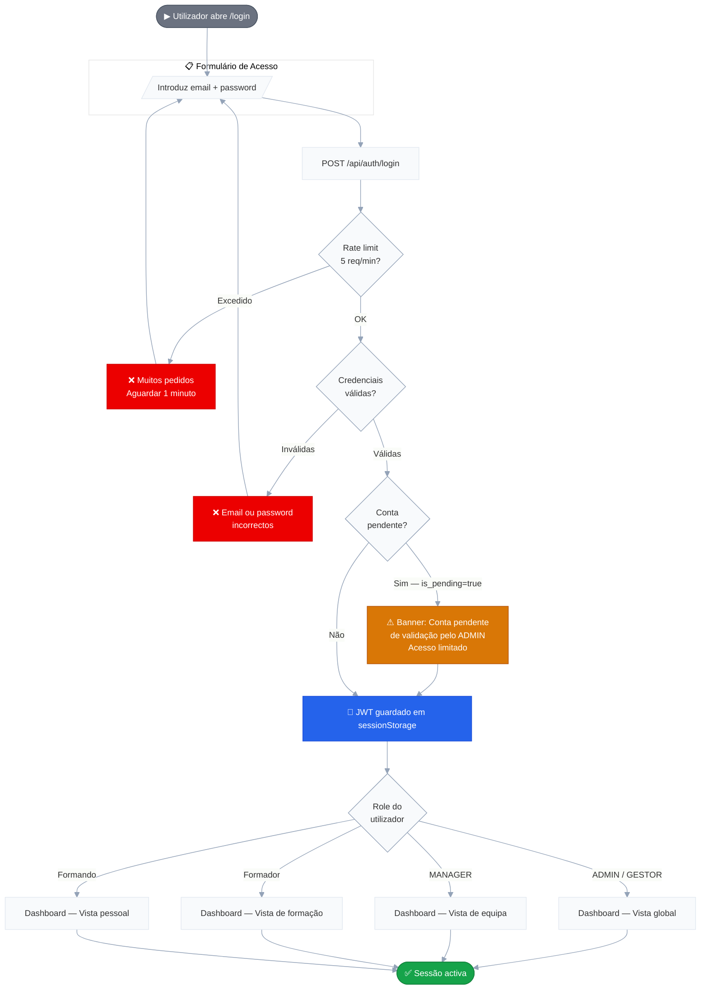
```mermaid
%%{init: {'theme': 'base', 'themeVariables': {'primaryColor': '#f8fafc', 'primaryBorderColor': '#e2e8f0', 'lineColor': '#94a3b8', 'fontSize': '13px'}}}%%
flowchart TD
    START([▶ Utilizador abre /login]) --> FORM

    subgraph ENTRADA["📋 Formulário de Acesso"]
        FORM[/Introduz email + password/]
    end

    FORM --> RATE[POST /api/auth/login]
    RATE --> CHK_RATE{Rate limit\n5 req/min?}
    CHK_RATE -->|Excedido| ERR_RATE[❌ Muitos pedidos\nAguardar 1 minuto]
    ERR_RATE --> FORM
    CHK_RATE -->|OK| CHK_CRED{Credenciais\nválidas?}

    CHK_CRED -->|Inválidas| ERR_CRED[❌ Email ou password\nincorrectos]
    ERR_CRED --> FORM

    CHK_CRED -->|Válidas| CHK_PEND{Conta\npendente?}

    CHK_PEND -->|Sim — is_pending=true| BANNER[⚠ Banner: Conta pendente\nde validação pelo ADMIN\nAcesso limitado]
    BANNER --> JWT

    CHK_PEND -->|Não| JWT[🔐 JWT guardado em sessionStorage]

    JWT --> ROLE{Role do\nutilizador}
    ROLE -->|ADMIN / GESTOR| DASH_ADMIN[Dashboard — Vista global]
    ROLE -->|MANAGER| DASH_MGR[Dashboard — Vista de equipa]
    ROLE -->|Formador| DASH_TRN[Dashboard — Vista de formação]
    ROLE -->|Formando| DASH_STU[Dashboard — Vista pessoal]

    DASH_ADMIN & DASH_MGR & DASH_TRN & DASH_STU --> END([✅ Sessão activa])

    style START fill:#6b7280,color:#fff,stroke:#4b5563
    style END fill:#16a34a,color:#fff,stroke:#15803d
    style ERR_RATE fill:#EC0000,color:#fff,stroke:#CC0000
    style ERR_CRED fill:#EC0000,color:#fff,stroke:#CC0000
    style BANNER fill:#d97706,color:#fff,stroke:#b45309
    style JWT fill:#2563eb,color:#fff,stroke:#1d4ed8
    style CHK_RATE fill:#f8fafc,stroke:#94a3b8
    style CHK_CRED fill:#f8fafc,stroke:#94a3b8
    style CHK_PEND fill:#f8fafc,stroke:#94a3b8
    style ROLE fill:#f8fafc,stroke:#94a3b8
```

---

### Fluxo 1.2 — Registo de Utilizador

> **Actores:** Novo utilizador (registo próprio)
> **Endpoint principal:** `POST /api/auth/register`
> **Nota:** Formandos têm acesso imediato. Formadores e Gestores ficam pendentes até validação do ADMIN.

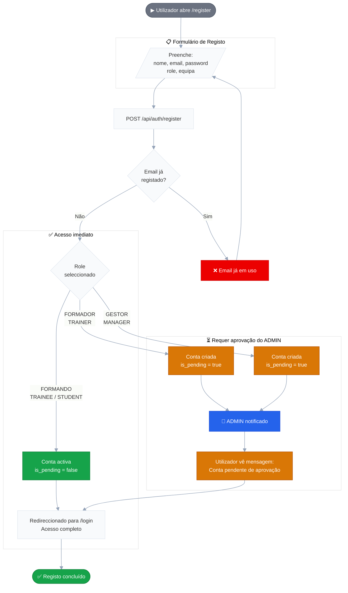
```mermaid
%%{init: {'theme': 'base', 'themeVariables': {'primaryColor': '#f8fafc', 'primaryBorderColor': '#e2e8f0', 'lineColor': '#94a3b8', 'fontSize': '13px'}}}%%
flowchart TD
    START([▶ Utilizador abre /register]) --> FORM

    subgraph FORM_BOX["📋 Formulário de Registo"]
        FORM[/Preenche:\nnome, email, password\nrole, equipa/]
    end

    FORM --> API[POST /api/auth/register]
    API --> CHK_EMAIL{Email já\nregistado?}

    CHK_EMAIL -->|Sim| ERR_EMAIL[❌ Email já em uso]
    ERR_EMAIL --> FORM

    CHK_EMAIL -->|Não| CHK_ROLE{Role\nseleccionado}

    subgraph FORMANDO_PATH["✅ Acesso imediato"]
        CHK_ROLE -->|FORMANDO\nTRAINEE / STUDENT| ACC_IMM[Conta activa\nis_pending = false]
        ACC_IMM --> LOGIN_OK[Redireccionado para /login\nAcesso completo]
    end

    subgraph PENDENTE_PATH["⏳ Requer aprovação do ADMIN"]
        CHK_ROLE -->|FORMADOR\nTRAINER| PEND_TRN[Conta criada\nis_pending = true]
        CHK_ROLE -->|GESTOR\nMANAGER| PEND_MGR[Conta criada\nis_pending = true]
        PEND_TRN & PEND_MGR --> NOTIF[📧 ADMIN notificado]
        NOTIF --> WAIT[Utilizador vê mensagem:\nConta pendente de aprovação]
        WAIT --> LOGIN_OK
    end

    LOGIN_OK --> END([✅ Registo concluído])

    style START fill:#6b7280,color:#fff,stroke:#4b5563
    style END fill:#16a34a,color:#fff,stroke:#15803d
    style ERR_EMAIL fill:#EC0000,color:#fff,stroke:#CC0000
    style ACC_IMM fill:#16a34a,color:#fff,stroke:#15803d
    style PEND_TRN fill:#d97706,color:#fff,stroke:#b45309
    style PEND_MGR fill:#d97706,color:#fff,stroke:#b45309
    style NOTIF fill:#2563eb,color:#fff,stroke:#1d4ed8
    style WAIT fill:#d97706,color:#fff,stroke:#b45309
```

---

### Fluxo 1.3 — Recuperação de Password

> **Actores:** Qualquer utilizador registado
> **Endpoints:** `POST /api/auth/forgot-password` → `POST /api/auth/reset-password`
> **Segurança:** A resposta é sempre a mesma independentemente de o email existir (anti-enumeração)

```mermaid
%%{init: {'theme': 'base', 'themeVariables': {'primaryColor': '#f8fafc', 'primaryBorderColor': '#e2e8f0', 'lineColor': '#94a3b8', 'fontSize': '13px'}}}%%
flowchart TD
    START([▶ Utilizador clica\n"Esqueci a password"]) --> INPUT_EMAIL

    subgraph FASE1["📧 Fase 1 — Pedido de recuperação"]
        INPUT_EMAIL[/Introduz email/]
        INPUT_EMAIL --> API1[POST /api/auth/forgot-password]
        API1 --> RATE{Rate limit\n3 req/min?}
        RATE -->|Excedido| ERR_RATE[❌ Muitos pedidos]
        ERR_RATE --> INPUT_EMAIL
        RATE -->|OK| RESP[✅ Resposta sempre igual\n"Se o email existir, receberá instruções"\n⚠ Por segurança — sem revelar existência do email]
    end

    RESP --> BD_CHK{Email existe\nna base de dados?}
    BD_CHK -->|Sim| TOKEN[🔑 Token gerado\nGuardado na BD\nEmail enviado com link]
    BD_CHK -->|Não| SILENT[🔇 Sem acção interna\nutilizador não sabe]

    TOKEN & SILENT --> USER_WAIT[Utilizador verifica o email]

    subgraph FASE2["🔑 Fase 2 — Redefinição de password"]
        USER_WAIT --> CLICK[Utilizador clica no link\n/reset-password?token=...]
        CLICK --> VALIDATE[GET /api/auth/validate-reset-token/:token]
        VALIDATE --> CHK_TOKEN{Token\nválido?}
        CHK_TOKEN -->|Expirado ou\nusado| ERR_TOKEN[❌ Link expirado\nou inválido]
        ERR_TOKEN --> INPUT_EMAIL
        CHK_TOKEN -->|Válido| NEW_PASS[/Introduz nova password/]
        NEW_PASS --> RESET[POST /api/auth/reset-password]
        RESET --> DONE[Token marcado como usado\nPassword actualizada na BD]
    end

    DONE --> REDIRECT[Redireccionado para /login]
    REDIRECT --> END([✅ Password alterada])

    style START fill:#6b7280,color:#fff,stroke:#4b5563
    style END fill:#16a34a,color:#fff,stroke:#15803d
    style ERR_RATE fill:#EC0000,color:#fff,stroke:#CC0000
    style ERR_TOKEN fill:#EC0000,color:#fff,stroke:#CC0000
    style RESP fill:#d97706,color:#fff,stroke:#b45309
    style TOKEN fill:#2563eb,color:#fff,stroke:#1d4ed8
    style DONE fill:#16a34a,color:#fff,stroke:#15803d
```

---

### Fluxo 1.4 — Validação de Formador Pendente (ADMIN)

> **Actores:** ADMIN
> **Local:** `/master-data/trainer-validation`
> **Objetivo:** Aprovar ou rejeitar contas de Formadores e Gestores com `is_pending = true`

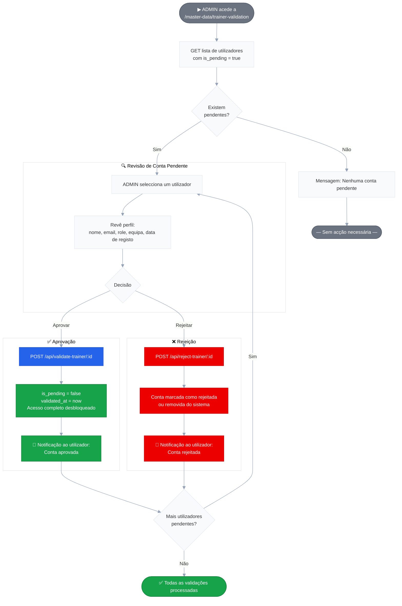
```mermaid
%%{init: {'theme': 'base', 'themeVariables': {'primaryColor': '#f8fafc', 'primaryBorderColor': '#e2e8f0', 'lineColor': '#94a3b8', 'fontSize': '13px'}}}%%
flowchart TD
    START([▶ ADMIN acede a\n/master-data/trainer-validation]) --> LOAD[GET lista de utilizadores\ncom is_pending = true]
    LOAD --> CHK_EMPTY{Existem\npendentes?}

    CHK_EMPTY -->|Não| EMPTY[Mensagem: Nenhuma conta pendente]
    EMPTY --> END_EMPTY([— Sem acção necessária —])

    CHK_EMPTY -->|Sim| SELECT

    subgraph REVIEW["🔍 Revisão de Conta Pendente"]
        SELECT[ADMIN selecciona um utilizador]
        SELECT --> VIEW[Revê perfil:\nnome, email, role, equipa, data de registo]
        VIEW --> DECIDE{Decisão}
    end

    subgraph APROVAR["✅ Aprovação"]
        DECIDE -->|Aprovar| API_APP[POST /api/validate-trainer/:id]
        API_APP --> ACTIVATED[is_pending = false\nvalidated_at = now\nAcesso completo desbloqueado]
        ACTIVATED --> NOTIF_OK[📧 Notificação ao utilizador:\nConta aprovada]
    end

    subgraph REJEITAR["❌ Rejeição"]
        DECIDE -->|Rejeitar| API_REJ[POST /api/reject-trainer/:id]
        API_REJ --> BLOCKED[Conta marcada como rejeitada\nou removida do sistema]
        BLOCKED --> NOTIF_FAIL[📧 Notificação ao utilizador:\nConta rejeitada]
    end

    NOTIF_OK & NOTIF_FAIL --> NEXT{Mais utilizadores\npendentes?}
    NEXT -->|Sim| SELECT
    NEXT -->|Não| END_ALL([✅ Todas as validações processadas])

    style START fill:#6b7280,color:#fff,stroke:#4b5563
    style END_ALL fill:#16a34a,color:#fff,stroke:#15803d
    style END_EMPTY fill:#6b7280,color:#fff,stroke:#4b5563
    style ACTIVATED fill:#16a34a,color:#fff,stroke:#15803d
    style BLOCKED fill:#EC0000,color:#fff,stroke:#CC0000
    style API_APP fill:#2563eb,color:#fff,stroke:#1d4ed8
    style API_REJ fill:#EC0000,color:#fff,stroke:#CC0000
    style NOTIF_OK fill:#16a34a,color:#fff,stroke:#15803d
    style NOTIF_FAIL fill:#EC0000,color:#fff,stroke:#CC0000
```

---

## 2. Portal de Formações

> **Glossário deste portal:**
> | Termo | Role técnico | Descrição |
> |---|---|---|
> | **Formador** | `TRAINER` | Cria conteúdo, revê submissões, emite certificados |
> | **Formando** | `TRAINEE` / `STUDENT` | Executa aulas, desafios e planos de formação |

---

### Fluxo 2.1 — Criação de Curso (Formador)

> **Actores:** Formador, ADMIN
> **Localização:** `/course/new`
> **Fluxo:** Criação de curso → Aulas → Desafios → Publicação

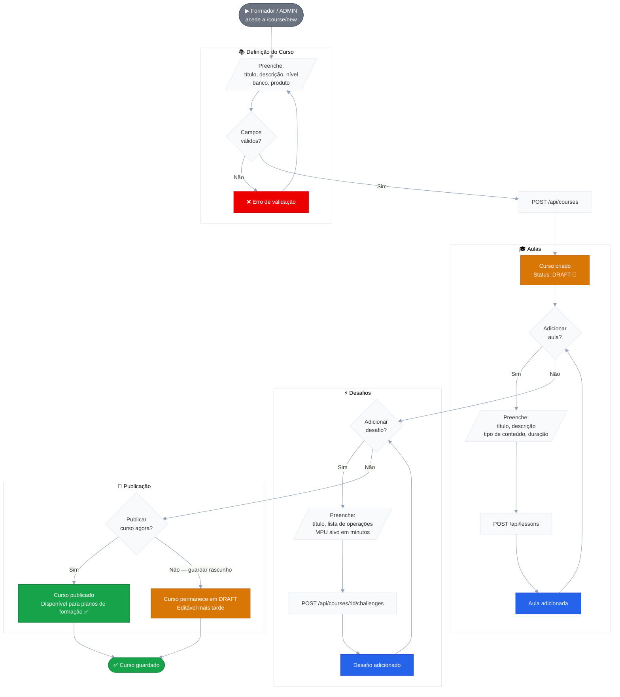
```mermaid
%%{init: {'theme': 'base', 'themeVariables': {'primaryColor': '#f8fafc', 'primaryBorderColor': '#e2e8f0', 'lineColor': '#94a3b8', 'fontSize': '13px'}}}%%
flowchart TD
    START([▶ Formador / ADMIN\nacede a /course/new]) --> FORM

    subgraph CURSO["📚 Definição do Curso"]
        FORM[/Preenche:\ntítulo, descrição, nível\nbanco, produto/]
        FORM --> VAL{Campos\nválidos?}
        VAL -->|Não| ERR_VAL[❌ Erro de validação]
        ERR_VAL --> FORM
    end

    VAL -->|Sim| API_COURSE[POST /api/courses]
    API_COURSE --> DRAFT[Curso criado\nStatus: DRAFT 📝]

    subgraph AULAS["🎓 Aulas"]
        DRAFT --> ASK_LESSON{Adicionar\naula?}
        ASK_LESSON -->|Sim| LESSON_FORM[/Preenche:\ntítulo, descrição\ntipo de conteúdo, duração/]
        LESSON_FORM --> API_LESSON[POST /api/lessons]
        API_LESSON --> LESSON_DONE[Aula adicionada]
        LESSON_DONE --> ASK_LESSON
    end

    subgraph DESAFIOS["⚡ Desafios"]
        ASK_LESSON -->|Não| ASK_CHALLENGE{Adicionar\ndesafio?}
        ASK_CHALLENGE -->|Sim| CHALLENGE_FORM[/Preenche:\ntítulo, lista de operações\nMPU alvo em minutos/]
        CHALLENGE_FORM --> API_CHALLENGE[POST /api/courses/:id/challenges]
        API_CHALLENGE --> CHALLENGE_DONE[Desafio adicionado]
        CHALLENGE_DONE --> ASK_CHALLENGE
    end

    subgraph PUBLICAR["🚀 Publicação"]
        ASK_CHALLENGE -->|Não| ASK_PUBLISH{Publicar\ncurso agora?}
        ASK_PUBLISH -->|Sim| PUBLISHED[Curso publicado\nDisponível para planos de formação ✅]
        ASK_PUBLISH -->|Não — guardar rascunho| KEPT_DRAFT[Curso permanece em DRAFT\nEditável mais tarde]
    end

    PUBLISHED & KEPT_DRAFT --> END([✅ Curso guardado])

    style START fill:#6b7280,color:#fff,stroke:#4b5563
    style END fill:#16a34a,color:#fff,stroke:#15803d
    style ERR_VAL fill:#EC0000,color:#fff,stroke:#CC0000
    style DRAFT fill:#d97706,color:#fff,stroke:#b45309
    style LESSON_DONE fill:#2563eb,color:#fff,stroke:#1d4ed8
    style CHALLENGE_DONE fill:#2563eb,color:#fff,stroke:#1d4ed8
    style PUBLISHED fill:#16a34a,color:#fff,stroke:#15803d
    style KEPT_DRAFT fill:#d97706,color:#fff,stroke:#b45309
```

---

### Fluxo 2.2 — Criação de Plano de Formação

> **Actores:** Formador, ADMIN
> **Localização:** `/training-plan/new`
> **Estados:** `DRAFT` → `ACTIVE` → `COMPLETED`

```mermaid
%%{init: {'theme': 'base', 'themeVariables': {'primaryColor': '#f8fafc', 'primaryBorderColor': '#e2e8f0', 'lineColor': '#94a3b8', 'fontSize': '13px'}}}%%
flowchart TD
    START([▶ Formador / ADMIN\nacede a /training-plan/new]) --> FORM

    subgraph PLANO["📋 Definição do Plano"]
        FORM[/Preenche:\ntítulo, descrição\nprazo, cursos a incluir/]
        FORM --> API_PLAN[POST /api/training-plans]
        API_PLAN --> DRAFT[Plano criado\nStatus: DRAFT 📝]
    end

    DRAFT --> ASSOC[Associar cursos:\nPOST /api/training-plans/:id/courses]

    subgraph ATRIBUICAO["👤 Atribuição ao Formando"]
        ASSOC --> SELECT_STU[/Seleccionar Formando(s)\na quem atribuir/]
        SELECT_STU --> API_ASSIGN[POST /api/training-plans/:id/assign\n→ TrainingPlanAssignment criado]
        API_ASSIGN --> ACTIVE[Plano activado\nStatus: ACTIVE 🔵]
    end

    ACTIVE --> VISIBLE[Formando vê plano em /my-plans]

    subgraph EXECUCAO["⚙️ Execução pelo Formando"]
        VISIBLE --> PROGRESS{Formando completa\ntodos os cursos?}
        PROGRESS -->|Não — em progresso| UPDATE[Progresso actualizado\nPlano permanece ACTIVE]
        UPDATE --> PROGRESS
        PROGRESS -->|Sim — todos aprovados| READY[Pronto para finalização\npelo Formador]
    end

    READY --> FINALIZE[POST /api/finalization/plan/:id/finalize\n→ Formador confirma conclusão]
    FINALIZE --> COMPLETED[Plano COMPLETED ✅\n→ ver Fluxo 2.6 para certificado]
    COMPLETED --> END([✅ Plano concluído])

    subgraph ESTADOS["📊 Estados do Plano"]
        direction LR
        ST1[DRAFT 📝] --> ST2[ACTIVE 🔵] --> ST3[COMPLETED ✅]
    end

    style START fill:#6b7280,color:#fff,stroke:#4b5563
    style END fill:#16a34a,color:#fff,stroke:#15803d
    style DRAFT fill:#d97706,color:#fff,stroke:#b45309
    style ACTIVE fill:#2563eb,color:#fff,stroke:#1d4ed8
    style COMPLETED fill:#16a34a,color:#fff,stroke:#15803d
    style ST1 fill:#d97706,color:#fff,stroke:#b45309
    style ST2 fill:#2563eb,color:#fff,stroke:#1d4ed8
    style ST3 fill:#16a34a,color:#fff,stroke:#15803d
```

---

### Fluxo 2.3 — Execução de Aula (Formando)

> **Actores:** Formando (inicia/pausa/conclui), Formador (aprova)
> **Estados:** `NOT_STARTED` → `IN_PROGRESS` → `PAUSED` → `COMPLETED` → `APPROVED`

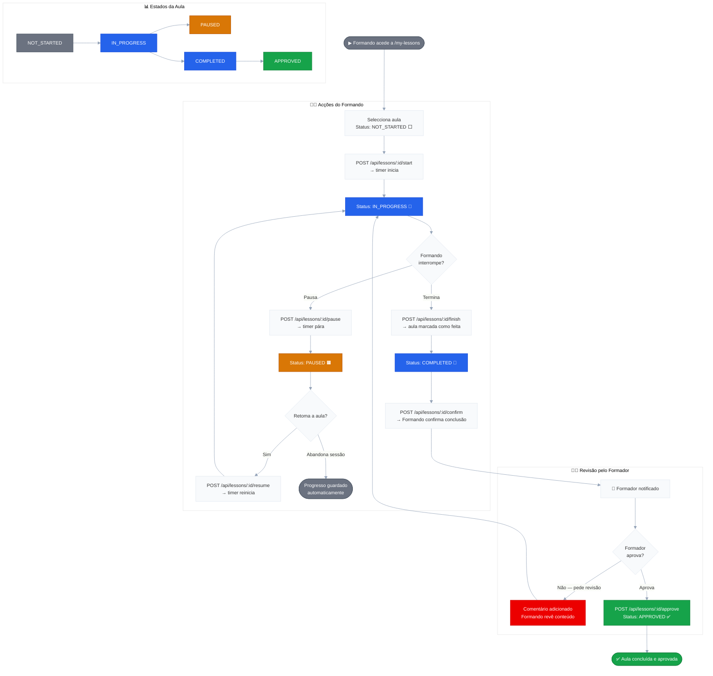
```mermaid
%%{init: {'theme': 'base', 'themeVariables': {'primaryColor': '#f8fafc', 'primaryBorderColor': '#e2e8f0', 'lineColor': '#94a3b8', 'fontSize': '13px'}}}%%
flowchart TD
    START([▶ Formando acede a /my-lessons]) --> SELECT[Selecciona aula\nStatus: NOT_STARTED ⬜]

    subgraph FORMANDO_FLOW["👨‍🎓 Acções do Formando"]
        SELECT --> START_LESSON[POST /api/lessons/:id/start\n→ timer inicia]
        START_LESSON --> IN_PROG[Status: IN_PROGRESS 🔵]

        IN_PROG --> INTERRUPT{Formando\ninterrompe?}
        INTERRUPT -->|Pausa| PAUSE[POST /api/lessons/:id/pause\n→ timer pára]
        PAUSE --> PAUSED[Status: PAUSED 🟧]
        PAUSED --> RESUME{Retoma a aula?}
        RESUME -->|Sim| RESTART[POST /api/lessons/:id/resume\n→ timer reinicia]
        RESTART --> IN_PROG
        RESUME -->|Abandona sessão| SAVED([Progresso guardado\nautomaticamente])

        INTERRUPT -->|Termina| FINISH[POST /api/lessons/:id/finish\n→ aula marcada como feita]
        FINISH --> COMPLETED[Status: COMPLETED 🔵]
        COMPLETED --> CONFIRM[POST /api/lessons/:id/confirm\n→ Formando confirma conclusão]
    end

    subgraph FORMADOR_FLOW["👨‍💼 Revisão pelo Formador"]
        CONFIRM --> NOTIF[📧 Formador notificado]
        NOTIF --> REVIEW{Formador\naprova?}
        REVIEW -->|Não — pede revisão| RETURN[Comentário adicionado\nFormando revê conteúdo]
        RETURN --> IN_PROG
        REVIEW -->|Aprova| APPROVE[POST /api/lessons/:id/approve\nStatus: APPROVED ✅]
    end

    APPROVE --> END([✅ Aula concluída e aprovada])

    subgraph ESTADOS["📊 Estados da Aula"]
        direction LR
        ES1[NOT_STARTED] --> ES2[IN_PROGRESS] --> ES3[PAUSED]
        ES2 --> ES4[COMPLETED] --> ES5[APPROVED]
    end

    style START fill:#6b7280,color:#fff,stroke:#4b5563
    style END fill:#16a34a,color:#fff,stroke:#15803d
    style IN_PROG fill:#2563eb,color:#fff,stroke:#1d4ed8
    style PAUSED fill:#d97706,color:#fff,stroke:#b45309
    style COMPLETED fill:#2563eb,color:#fff,stroke:#1d4ed8
    style APPROVE fill:#16a34a,color:#fff,stroke:#15803d
    style RETURN fill:#EC0000,color:#fff,stroke:#CC0000
    style SAVED fill:#6b7280,color:#fff,stroke:#4b5563
    style ES1 fill:#6b7280,color:#fff,stroke:#4b5563
    style ES2 fill:#2563eb,color:#fff,stroke:#1d4ed8
    style ES3 fill:#d97706,color:#fff,stroke:#b45309
    style ES4 fill:#2563eb,color:#fff,stroke:#1d4ed8
    style ES5 fill:#16a34a,color:#fff,stroke:#15803d
```

---

### Fluxo 2.4 — Execução de Desafio (Formando)

> **Actores:** Formador (liberta o desafio), Formando (executa), Formador (recebe para revisão)
> **Métrica calculada:** MPU — Minutos Por Operação
> **Estados:** `IN_PROGRESS` → `PENDING_REVIEW` → `REVIEWED`

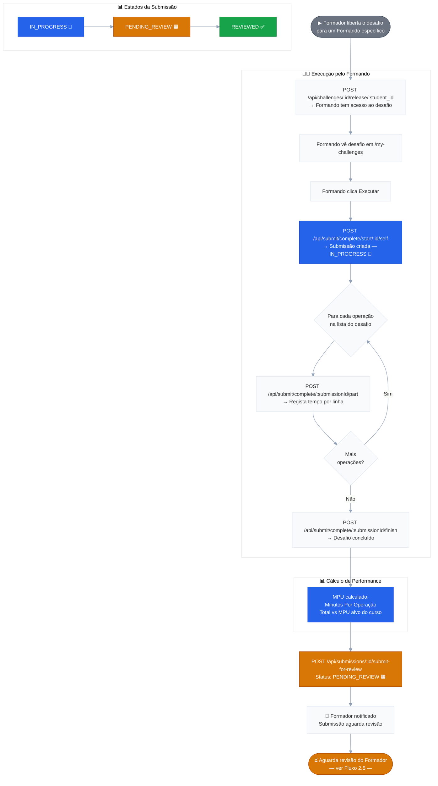
```mermaid
%%{init: {'theme': 'base', 'themeVariables': {'primaryColor': '#f8fafc', 'primaryBorderColor': '#e2e8f0', 'lineColor': '#94a3b8', 'fontSize': '13px'}}}%%
flowchart TD
    START([▶ Formador liberta o desafio\npara um Formando específico]) --> RELEASE[POST /api/challenges/:id/release/:student_id\n→ Formando tem acesso ao desafio]

    subgraph FORMANDO_EXEC["👨‍🎓 Execução pelo Formando"]
        RELEASE --> SEE[Formando vê desafio em /my-challenges]
        SEE --> BEGIN[Formando clica Executar]
        BEGIN --> START_SUB[POST /api/submit/complete/start/:id/self\n→ Submissão criada — IN_PROGRESS 🔵]

        START_SUB --> LOOP{Para cada operação\nna lista do desafio}
        LOOP --> REG_OP[POST /api/submit/complete/:submissionId/part\n→ Regista tempo por linha]
        REG_OP --> MORE{Mais\noperações?}
        MORE -->|Sim| LOOP
        MORE -->|Não| FINISH_SUB[POST /api/submit/complete/:submissionId/finish\n→ Desafio concluído]
    end

    subgraph CALCULO["📊 Cálculo de Performance"]
        FINISH_SUB --> MPU[MPU calculado:\nMinutos Por Operação\nTotal vs MPU alvo do curso]
    end

    MPU --> SUBMIT[POST /api/submissions/:id/submit-for-review\nStatus: PENDING_REVIEW 🟧]
    SUBMIT --> NOTIF[📧 Formador notificado\nSubmissão aguarda revisão]
    NOTIF --> END([⏳ Aguarda revisão do Formador\n— ver Fluxo 2.5 —])

    subgraph ESTADOS["📊 Estados da Submissão"]
        direction LR
        SB1[IN_PROGRESS 🔵] --> SB2[PENDING_REVIEW 🟧] --> SB3[REVIEWED ✅]
    end

    style START fill:#6b7280,color:#fff,stroke:#4b5563
    style END fill:#d97706,color:#fff,stroke:#b45309
    style START_SUB fill:#2563eb,color:#fff,stroke:#1d4ed8
    style MPU fill:#2563eb,color:#fff,stroke:#1d4ed8
    style SUBMIT fill:#d97706,color:#fff,stroke:#b45309
    style SB1 fill:#2563eb,color:#fff,stroke:#1d4ed8
    style SB2 fill:#d97706,color:#fff,stroke:#b45309
    style SB3 fill:#16a34a,color:#fff,stroke:#15803d
```

---

### Fluxo 2.5 — Revisão de Submissão (Formador)

> **Actores:** Formador, ADMIN
> **Localização:** `/pending-reviews`
> **Decisão:** Aprovar (progride no plano) ou Rejeitar (com opção de retentativa)

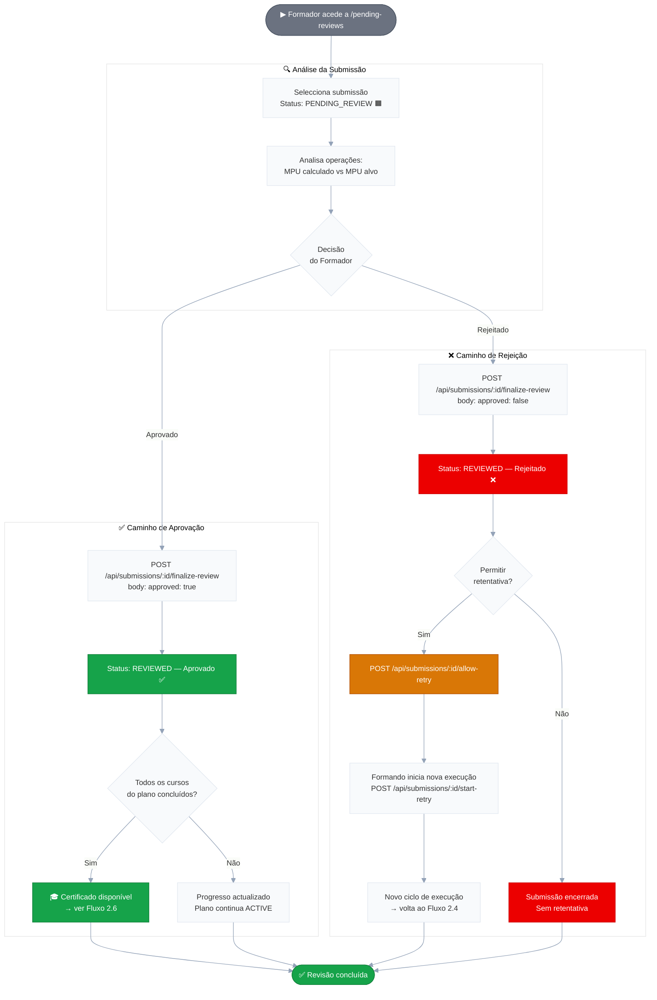
```mermaid
%%{init: {'theme': 'base', 'themeVariables': {'primaryColor': '#f8fafc', 'primaryBorderColor': '#e2e8f0', 'lineColor': '#94a3b8', 'fontSize': '13px'}}}%%
flowchart TD
    START([▶ Formador acede a /pending-reviews]) --> SELECT[Selecciona submissão\nStatus: PENDING_REVIEW 🟧]

    subgraph ANALISE["🔍 Análise da Submissão"]
        SELECT --> ANALYZE[Analisa operações:\nMPU calculado vs MPU alvo]
        ANALYZE --> DECIDE{Decisão\ndo Formador}
    end

    subgraph APROVADO["✅ Caminho de Aprovação"]
        DECIDE -->|Aprovado| API_APP[POST /api/submissions/:id/finalize-review\nbody: approved: true]
        API_APP --> APP_STATUS[Status: REVIEWED — Aprovado ✅]
        APP_STATUS --> CHK_PLAN{Todos os cursos\ndo plano concluídos?}
        CHK_PLAN -->|Sim| CERT[🎓 Certificado disponível\n→ ver Fluxo 2.6]
        CHK_PLAN -->|Não| PROGRESS[Progresso actualizado\nPlano continua ACTIVE]
    end

    subgraph REJEITADO["❌ Caminho de Rejeição"]
        DECIDE -->|Rejeitado| API_REJ[POST /api/submissions/:id/finalize-review\nbody: approved: false]
        API_REJ --> REJ_STATUS[Status: REVIEWED — Rejeitado ❌]
        REJ_STATUS --> RETRY{Permitir\nretentativa?}
        RETRY -->|Sim| ALLOW[POST /api/submissions/:id/allow-retry]
        ALLOW --> NEW_EXEC[Formando inicia nova execução\nPOST /api/submissions/:id/start-retry]
        NEW_EXEC --> NEW_CYCLE[Novo ciclo de execução\n→ volta ao Fluxo 2.4]
        RETRY -->|Não| CLOSED[Submissão encerrada\nSem retentativa]
    end

    CERT & PROGRESS & NEW_CYCLE & CLOSED --> END([✅ Revisão concluída])

    style START fill:#6b7280,color:#fff,stroke:#4b5563
    style END fill:#16a34a,color:#fff,stroke:#15803d
    style APP_STATUS fill:#16a34a,color:#fff,stroke:#15803d
    style REJ_STATUS fill:#EC0000,color:#fff,stroke:#CC0000
    style CERT fill:#16a34a,color:#fff,stroke:#15803d
    style ALLOW fill:#d97706,color:#fff,stroke:#b45309
    style CLOSED fill:#EC0000,color:#fff,stroke:#CC0000
```

---

### Fluxo 2.6 — Geração de Certificado

> **Actores:** Formador (finaliza), Formando (faz download)
> **Pré-condição:** Todas as submissões do plano com status `REVIEWED — Aprovado`

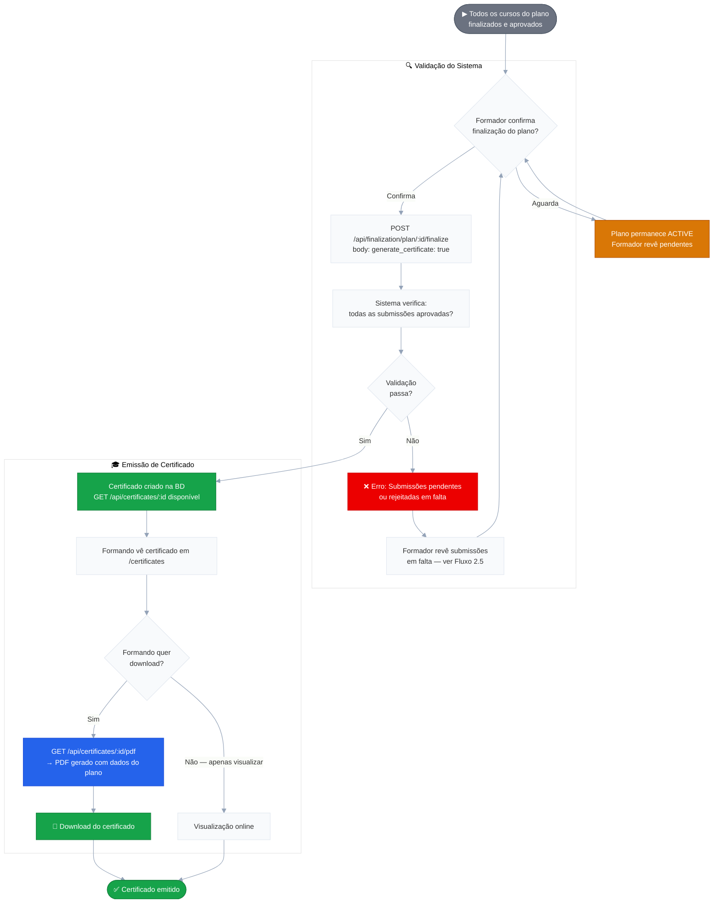
```mermaid
%%{init: {'theme': 'base', 'themeVariables': {'primaryColor': '#f8fafc', 'primaryBorderColor': '#e2e8f0', 'lineColor': '#94a3b8', 'fontSize': '13px'}}}%%
flowchart TD
    START([▶ Todos os cursos do plano\nfinalizados e aprovados]) --> CONFIRM{Formador confirma\nfinalização do plano?}

    CONFIRM -->|Aguarda| WAIT[Plano permanece ACTIVE\nFormador revê pendentes]
    WAIT --> CONFIRM

    CONFIRM -->|Confirma| API_FIN[POST /api/finalization/plan/:id/finalize\nbody: generate_certificate: true]

    subgraph VALIDACAO["🔍 Validação do Sistema"]
        API_FIN --> SYS_CHECK[Sistema verifica:\ntodas as submissões aprovadas?]
        SYS_CHECK --> CHK_VAL{Validação\npassa?}
        CHK_VAL -->|Não| ERR_PEND[❌ Erro: Submissões pendentes\nou rejeitadas em falta]
        ERR_PEND --> REVIEW_MISS[Formador revê submissões\nem falta — ver Fluxo 2.5]
        REVIEW_MISS --> CONFIRM
    end

    subgraph CERTIFICADO["🎓 Emissão de Certificado"]
        CHK_VAL -->|Sim| CREATE_CERT[Certificado criado na BD\nGET /api/certificates/:id disponível]
        CREATE_CERT --> FORMANDO_VIEW[Formando vê certificado em /certificates]
        FORMANDO_VIEW --> DOWNLOAD{Formando quer\ndownload?}
        DOWNLOAD -->|Sim| PDF[GET /api/certificates/:id/pdf\n→ PDF gerado com dados do plano]
        PDF --> SAVE[💾 Download do certificado]
        DOWNLOAD -->|Não — apenas visualizar| VIEW_ONLY[Visualização online]
    end

    SAVE & VIEW_ONLY --> END([✅ Certificado emitido])

    style START fill:#6b7280,color:#fff,stroke:#4b5563
    style END fill:#16a34a,color:#fff,stroke:#15803d
    style WAIT fill:#d97706,color:#fff,stroke:#b45309
    style ERR_PEND fill:#EC0000,color:#fff,stroke:#CC0000
    style CREATE_CERT fill:#16a34a,color:#fff,stroke:#15803d
    style PDF fill:#2563eb,color:#fff,stroke:#1d4ed8
    style SAVE fill:#16a34a,color:#fff,stroke:#15803d
```

---

## 3. Portal de Tutoria

> **Glossário deste portal:**
> | Termo | Role técnico | Descrição |
> |---|---|---|
> | **Tutor** | `TRAINER` com flag `is_tutor=true` | Analisa erros, cria planos de acção |
> | **Gravador** | `TRAINER` (mesmo utilizador, papel na tutoria) | Regista cápsulas, conduz side-by-side, é avaliado em surveys |
> | **Liberador** | `TRAINER` com flag `is_liberador=true` | Libera operações, regista erros internos, responde a surveys |
> | **Tutorado** | `TRAINEE` / `STUDENT` | Recebe tutoria, confirma resolução de erros |
>
> ℹ️ O **Formador** (no Portal de Formações) e o **Gravador** (no Portal de Tutoria) são o **mesmo utilizador** com role `TRAINER`.

---

### Fluxo 3.1 — Registo de Erro de Tutoria

> **Actores:** Liberador ou Tutor (regista), Tutor (analisa)
> **Localização:** `/tutoria/errors/new`
> **Severidades:** BAIXA → MÉDIA → ALTA → CRÍTICA

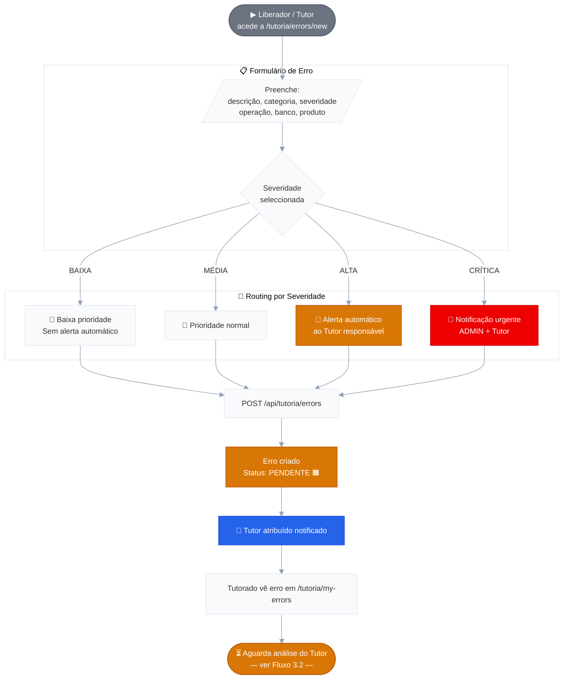
```mermaid
%%{init: {'theme': 'base', 'themeVariables': {'primaryColor': '#f8fafc', 'primaryBorderColor': '#e2e8f0', 'lineColor': '#94a3b8', 'fontSize': '13px'}}}%%
flowchart TD
    START([▶ Liberador / Tutor\nacede a /tutoria/errors/new]) --> FORM

    subgraph REGISTO["📋 Formulário de Erro"]
        FORM[/Preenche:\ndescrição, categoria, severidade\noperação, banco, produto/]
        FORM --> SEV{Severidade\nseleccionada}
    end

    subgraph PRIORIDADE["🚦 Routing por Severidade"]
        SEV -->|BAIXA| PRIO_LOW[📗 Baixa prioridade\nSem alerta automático]
        SEV -->|MÉDIA| PRIO_MED[📙 Prioridade normal]
        SEV -->|ALTA| PRIO_HIGH[📙 Alerta automático\nao Tutor responsável]
        SEV -->|CRÍTICA| PRIO_CRIT[🔴 Notificação urgente\nADMIN + Tutor]
    end

    PRIO_LOW & PRIO_MED & PRIO_HIGH & PRIO_CRIT --> API[POST /api/tutoria/errors]
    API --> CREATED[Erro criado\nStatus: PENDENTE 🟧]
    CREATED --> NOTIF[📧 Tutor atribuído notificado]
    NOTIF --> TUTORADO[Tutorado vê erro em /tutoria/my-errors]
    TUTORADO --> END([⏳ Aguarda análise do Tutor\n— ver Fluxo 3.2 —])

    style START fill:#6b7280,color:#fff,stroke:#4b5563
    style END fill:#d97706,color:#fff,stroke:#b45309
    style PRIO_CRIT fill:#EC0000,color:#fff,stroke:#CC0000
    style PRIO_HIGH fill:#d97706,color:#fff,stroke:#b45309
    style CREATED fill:#d97706,color:#fff,stroke:#b45309
    style NOTIF fill:#2563eb,color:#fff,stroke:#1d4ed8
```

---

### Fluxo 3.2 — Ciclo Completo de Erro (6 estados)

> **Actores:** Tutor (analisa, planeia, resolve), Chefe de equipa (aprova análise), Tutorado (confirma)
> **Estados:** PENDENTE → EM_ANÁLISE → AGUARDA_PLANOS → EM_EXECUÇÃO → VERIFICAÇÃO → RESOLVIDO

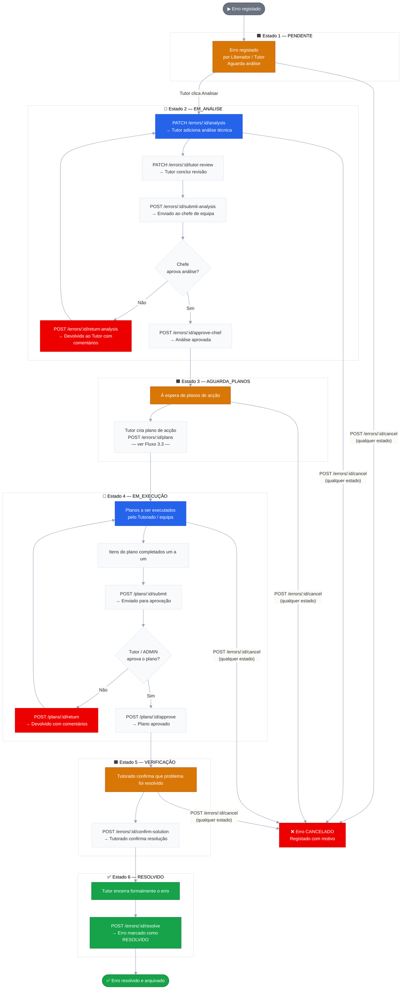
```mermaid
%%{init: {'theme': 'base', 'themeVariables': {'primaryColor': '#f8fafc', 'primaryBorderColor': '#e2e8f0', 'lineColor': '#94a3b8', 'fontSize': '13px'}}}%%
flowchart TD
    START([▶ Erro registado]) --> S1

    subgraph ESTADO1["🟧 Estado 1 — PENDENTE"]
        S1[Erro registado\npor Liberador / Tutor\nAguarda análise]
    end

    S1 -->|Tutor clica Analisar| S2_ENTRY

    subgraph ESTADO2["🔵 Estado 2 — EM_ANÁLISE"]
        S2_ENTRY[PATCH /errors/:id/analysis\n→ Tutor adiciona análise técnica]
        S2_ENTRY --> S2_REVIEW[PATCH /errors/:id/tutor-review\n→ Tutor conclui revisão]
        S2_REVIEW --> S2_SUBMIT[POST /errors/:id/submit-analysis\n→ Enviado ao chefe de equipa]
        S2_SUBMIT --> S2_CHF{Chefe\naprova análise?}
        S2_CHF -->|Não| S2_RETURN[POST /errors/:id/return-analysis\n→ Devolvido ao Tutor com comentários]
        S2_RETURN --> S2_ENTRY
        S2_CHF -->|Sim| S2_OK[POST /errors/:id/approve-chief\n→ Análise aprovada]
    end

    S2_OK --> S3

    subgraph ESTADO3["🟧 Estado 3 — AGUARDA_PLANOS"]
        S3[À espera de planos de acção]
        S3 --> S3_PLAN[Tutor cria plano de acção\nPOST /errors/:id/plans\n— ver Fluxo 3.3 —]
    end

    S3_PLAN --> S4

    subgraph ESTADO4["🔵 Estado 4 — EM_EXECUÇÃO"]
        S4[Planos a ser executados\npelo Tutorado / equipa]
        S4 --> S4_ITEMS[Itens do plano completados um a um]
        S4_ITEMS --> S4_SUBMIT[POST /plans/:id/submit\n→ Enviado para aprovação]
        S4_SUBMIT --> S4_CHK{Tutor / ADMIN\naprova o plano?}
        S4_CHK -->|Não| S4_RETURN[POST /plans/:id/return\n→ Devolvido com comentários]
        S4_RETURN --> S4
        S4_CHK -->|Sim| S4_OK[POST /plans/:id/approve\n→ Plano aprovado]
    end

    S4_OK --> S5

    subgraph ESTADO5["🟧 Estado 5 — VERIFICAÇÃO"]
        S5[Tutorado confirma que problema foi resolvido]
        S5 --> S5_CONFIRM[POST /errors/:id/confirm-solution\n→ Tutorado confirma resolução]
    end

    S5_CONFIRM --> S6

    subgraph ESTADO6["✅ Estado 6 — RESOLVIDO"]
        S6[Tutor encerra formalmente o erro]
        S6 --> S6_CLOSE[POST /errors/:id/resolve\n→ Erro marcado como RESOLVIDO]
    end

    S6_CLOSE --> FIM([✅ Erro resolvido e arquivado])

    S1 & S2_ENTRY & S3 & S4 & S5 -->|"POST /errors/:id/cancel\n(qualquer estado)"| CANCEL[❌ Erro CANCELADO\nRegistado com motivo]

    style START fill:#6b7280,color:#fff,stroke:#4b5563
    style FIM fill:#16a34a,color:#fff,stroke:#15803d
    style S1 fill:#d97706,color:#fff,stroke:#b45309
    style S3 fill:#d97706,color:#fff,stroke:#b45309
    style S5 fill:#d97706,color:#fff,stroke:#b45309
    style S4 fill:#2563eb,color:#fff,stroke:#1d4ed8
    style S2_ENTRY fill:#2563eb,color:#fff,stroke:#1d4ed8
    style S6 fill:#16a34a,color:#fff,stroke:#15803d
    style S6_CLOSE fill:#16a34a,color:#fff,stroke:#15803d
    style S2_RETURN fill:#EC0000,color:#fff,stroke:#CC0000
    style S4_RETURN fill:#EC0000,color:#fff,stroke:#CC0000
    style CANCEL fill:#EC0000,color:#fff,stroke:#CC0000
```

---

### Fluxo 3.3 — Criação e Aprovação de Plano de Acção

> **Actores:** Tutor (cria e valida), Tutorado (executa)
> **Estados:** RASCUNHO → EM_REVISÃO → APROVADO → EM_EXECUÇÃO → CONCLUÍDO

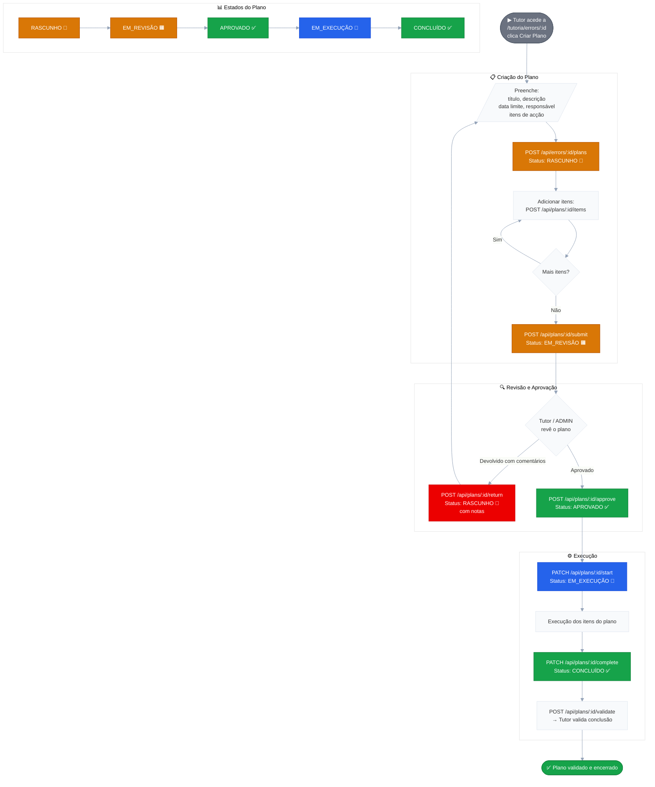
```mermaid
%%{init: {'theme': 'base', 'themeVariables': {'primaryColor': '#f8fafc', 'primaryBorderColor': '#e2e8f0', 'lineColor': '#94a3b8', 'fontSize': '13px'}}}%%
flowchart TD
    START([▶ Tutor acede a\n/tutoria/errors/:id\nclica Criar Plano]) --> FORM

    subgraph CRIACAO["📋 Criação do Plano"]
        FORM[/Preenche:\ntítulo, descrição\ndata limite, responsável\nitens de acção/]
        FORM --> API_CREATE[POST /api/errors/:id/plans\nStatus: RASCUNHO 📝]
        API_CREATE --> ITEMS[Adicionar itens:\nPOST /api/plans/:id/items]
        ITEMS --> MORE{Mais itens?}
        MORE -->|Sim| ITEMS
        MORE -->|Não| SUBMIT[POST /api/plans/:id/submit\nStatus: EM_REVISÃO 🟧]
    end

    subgraph REVISAO["🔍 Revisão e Aprovação"]
        SUBMIT --> REVIEW{Tutor / ADMIN\nrevê o plano}
        REVIEW -->|Devolvido com comentários| RETURN[POST /api/plans/:id/return\nStatus: RASCUNHO 📝\ncom notas]
        RETURN --> FORM
        REVIEW -->|Aprovado| APPROVE[POST /api/plans/:id/approve\nStatus: APROVADO ✅]
    end

    subgraph EXECUCAO["⚙️ Execução"]
        APPROVE --> START_EXEC[PATCH /api/plans/:id/start\nStatus: EM_EXECUÇÃO 🔵]
        START_EXEC --> DO[Execução dos itens do plano]
        DO --> COMPLETE[PATCH /api/plans/:id/complete\nStatus: CONCLUÍDO ✅]
        COMPLETE --> VALIDATE[POST /api/plans/:id/validate\n→ Tutor valida conclusão]
    end

    VALIDATE --> END([✅ Plano validado e encerrado])

    subgraph ESTADOS["📊 Estados do Plano"]
        direction LR
        PA1[RASCUNHO 📝] --> PA2[EM_REVISÃO 🟧] --> PA3[APROVADO ✅] --> PA4[EM_EXECUÇÃO 🔵] --> PA5[CONCLUÍDO ✅]
    end

    style START fill:#6b7280,color:#fff,stroke:#4b5563
    style END fill:#16a34a,color:#fff,stroke:#15803d
    style API_CREATE fill:#d97706,color:#fff,stroke:#b45309
    style SUBMIT fill:#d97706,color:#fff,stroke:#b45309
    style APPROVE fill:#16a34a,color:#fff,stroke:#15803d
    style RETURN fill:#EC0000,color:#fff,stroke:#CC0000
    style START_EXEC fill:#2563eb,color:#fff,stroke:#1d4ed8
    style COMPLETE fill:#16a34a,color:#fff,stroke:#15803d
    style PA1 fill:#d97706,color:#fff,stroke:#b45309
    style PA2 fill:#d97706,color:#fff,stroke:#b45309
    style PA3 fill:#16a34a,color:#fff,stroke:#15803d
    style PA4 fill:#2563eb,color:#fff,stroke:#1d4ed8
    style PA5 fill:#16a34a,color:#fff,stroke:#15803d
```

---

### Fluxo 3.4 — Side-by-Side (Gravador conduz sessão)

> **Actores:** Gravador (= Formador no papel de observador em tutoria), Tutorado
> **Localização:** `/tutoria/side-by-side`
> **Objetivo:** Observação directa de operações com registo de MPU em tempo real

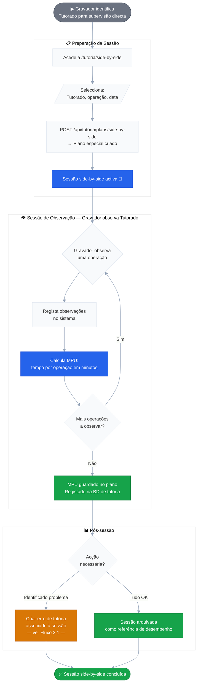
```mermaid
%%{init: {'theme': 'base', 'themeVariables': {'primaryColor': '#f8fafc', 'primaryBorderColor': '#e2e8f0', 'lineColor': '#94a3b8', 'fontSize': '13px'}}}%%
flowchart TD
    START([▶ Gravador identifica\nTutorado para supervisão directa]) --> ACESSO[Acede a /tutoria/side-by-side]

    subgraph PREPARACAO["📋 Preparação da Sessão"]
        ACESSO --> SETUP[/Selecciona:\nTutorado, operação, data/]
        SETUP --> API_SBS[POST /api/tutoria/plans/side-by-side\n→ Plano especial criado]
        API_SBS --> ACTIVE[Sessão side-by-side activa 🔵]
    end

    subgraph SESSAO["👁️ Sessão de Observação — Gravador observa Tutorado"]
        ACTIVE --> OBSERVE{Gravador observa\numa operação}
        OBSERVE --> RECORD[Regista observações\nno sistema]
        RECORD --> MPU_CALC[Calcula MPU:\ntempo por operação em minutos]
        MPU_CALC --> NEXT_OP{Mais operações\na observar?}
        NEXT_OP -->|Sim| OBSERVE
        NEXT_OP -->|Não| SAVE_MPU[MPU guardado no plano\nRegistado na BD de tutoria]
    end

    subgraph POS_SESSAO["📊 Pós-sessão"]
        SAVE_MPU --> ACTION{Acção\nnecessária?}
        ACTION -->|Identificado problema| CREATE_ERROR[Criar erro de tutoria\nassociado à sessão\n— ver Fluxo 3.1 —]
        ACTION -->|Tudo OK| ARCHIVE[Sessão arquivada\ncomo referência de desempenho]
    end

    CREATE_ERROR & ARCHIVE --> END([✅ Sessão side-by-side concluída])

    style START fill:#6b7280,color:#fff,stroke:#4b5563
    style END fill:#16a34a,color:#fff,stroke:#15803d
    style ACTIVE fill:#2563eb,color:#fff,stroke:#1d4ed8
    style MPU_CALC fill:#2563eb,color:#fff,stroke:#1d4ed8
    style SAVE_MPU fill:#16a34a,color:#fff,stroke:#15803d
    style CREATE_ERROR fill:#d97706,color:#fff,stroke:#b45309
    style ARCHIVE fill:#16a34a,color:#fff,stroke:#15803d
```

---

### Fluxo 3.5 — Ciclo de Feedback Semanal

> **Actores:** Tutor (cria survey), Liberador (responde), Gravador (é avaliado)
> **Nota:** O Gravador é a mesma pessoa que o Formador — é avaliado pelo Liberador
> **Localização:** `/tutoria/feedback`

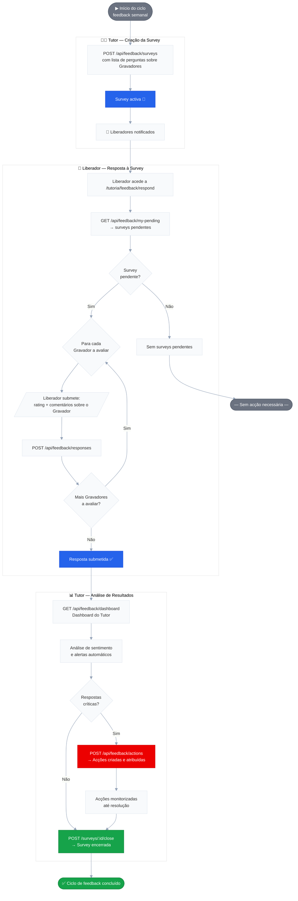
```mermaid
%%{init: {'theme': 'base', 'themeVariables': {'primaryColor': '#f8fafc', 'primaryBorderColor': '#e2e8f0', 'lineColor': '#94a3b8', 'fontSize': '13px'}}}%%
flowchart TD
    START([▶ Início do ciclo\nfeedback semanal]) --> TUTOR_CREATE

    subgraph TUTOR_CRIA["👨‍🏫 Tutor — Criação da Survey"]
        TUTOR_CREATE[POST /api/feedback/surveys\ncom lista de perguntas sobre Gravadores]
        TUTOR_CREATE --> SURVEY_ACTIVE[Survey activa 🔵]
        SURVEY_ACTIVE --> NOTIF_LIB[📧 Liberadores notificados]
    end

    subgraph LIBERADOR_RESPONDE["👤 Liberador — Resposta à Survey"]
        NOTIF_LIB --> LIB_ACCESS[Liberador acede a /tutoria/feedback/respond]
        LIB_ACCESS --> GET_PENDING[GET /api/feedback/my-pending\n→ surveys pendentes]
        GET_PENDING --> CHK_SURVEY{Survey\npendente?}
        CHK_SURVEY -->|Não| NO_SURVEY[Sem surveys pendentes]
        CHK_SURVEY -->|Sim| PER_GRAVADOR{Para cada\nGravador a avaliar}
        PER_GRAVADOR --> RATE[/Liberador submete:\nrating + comentários sobre o Gravador/]
        RATE --> API_RESP[POST /api/feedback/responses]
        API_RESP --> MORE_GRAV{Mais Gravadores\na avaliar?}
        MORE_GRAV -->|Sim| PER_GRAVADOR
        MORE_GRAV -->|Não| SUBMITTED[Resposta submetida ✅]
    end

    subgraph TUTOR_ANALISA["📊 Tutor — Análise de Resultados"]
        SUBMITTED --> DASH[GET /api/feedback/dashboard\nDashboard do Tutor]
        DASH --> SENTIMENT[Análise de sentimento\ne alertas automáticos]
        SENTIMENT --> CRITICAL{Respostas\ncríticas?}
        CRITICAL -->|Sim| ACTIONS[POST /api/feedback/actions\n→ Acções criadas e atribuídas]
        ACTIONS --> MONITOR[Acções monitorizadas\naté resolução]
        CRITICAL -->|Não| CLOSE
        MONITOR --> CLOSE[POST /surveys/:id/close\n→ Survey encerrada]
    end

    CLOSE --> END([✅ Ciclo de feedback concluído])
    NO_SURVEY --> END_EMPTY([— Sem acção necessária —])

    style START fill:#6b7280,color:#fff,stroke:#4b5563
    style END fill:#16a34a,color:#fff,stroke:#15803d
    style END_EMPTY fill:#6b7280,color:#fff,stroke:#4b5563
    style SURVEY_ACTIVE fill:#2563eb,color:#fff,stroke:#1d4ed8
    style SUBMITTED fill:#2563eb,color:#fff,stroke:#1d4ed8
    style ACTIONS fill:#EC0000,color:#fff,stroke:#CC0000
    style CLOSE fill:#16a34a,color:#fff,stroke:#15803d
```

---

### Fluxo 3.6 — Erro Interno (Liberador)

> **Actores:** Liberador (regista), Tutor (trata), Gravador (mencionado no erro)
> **Localização:** `/tutoria/internal-errors/new`
> **Nota:** O campo "gravador" no formulário refere-se ao Formador (`TRAINER`) que actuou naquela operação

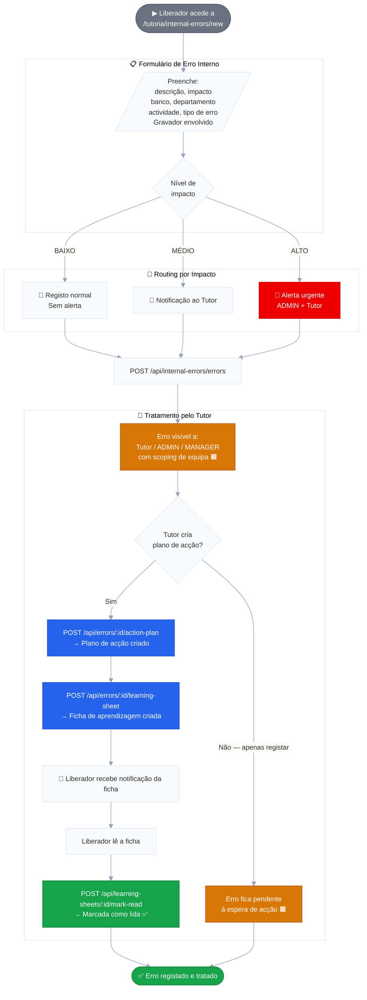
```mermaid
%%{init: {'theme': 'base', 'themeVariables': {'primaryColor': '#f8fafc', 'primaryBorderColor': '#e2e8f0', 'lineColor': '#94a3b8', 'fontSize': '13px'}}}%%
flowchart TD
    START([▶ Liberador acede a\n/tutoria/internal-errors/new]) --> FORM

    subgraph REGISTO["📋 Formulário de Erro Interno"]
        FORM[/Preenche:\ndescrição, impacto\nbanco, departamento\nactividade, tipo de erro\nGravador envolvido/]
        FORM --> IMP{Nível de\nimpacto}
    end

    subgraph ROUTING["🚦 Routing por Impacto"]
        IMP -->|BAIXO| LOW[📗 Registo normal\nSem alerta]
        IMP -->|MÉDIO| MED[📙 Notificação ao Tutor]
        IMP -->|ALTO| HIGH[🔴 Alerta urgente\nADMIN + Tutor]
    end

    LOW & MED & HIGH --> API[POST /api/internal-errors/errors]
    API --> VISIBLE[Erro visível a:\nTutor / ADMIN / MANAGER\ncom scoping de equipa 🟧]

    subgraph TRATAMENTO["🔧 Tratamento pelo Tutor"]
        VISIBLE --> PLAN_CHK{Tutor cria\nplano de acção?}
        PLAN_CHK -->|Sim| ACTION_PLAN[POST /api/errors/:id/action-plan\n→ Plano de acção criado]
        ACTION_PLAN --> LEARN[POST /api/errors/:id/learning-sheet\n→ Ficha de aprendizagem criada]
        LEARN --> NOTIF_LIB[📧 Liberador recebe notificação da ficha]
        NOTIF_LIB --> LIB_READ[Liberador lê a ficha]
        LIB_READ --> MARK_READ[POST /api/learning-sheets/:id/mark-read\n→ Marcada como lida ✅]
        PLAN_CHK -->|Não — apenas registar| PENDING[Erro fica pendente\nà espera de acção 🟧]
    end

    MARK_READ & PENDING --> END([✅ Erro registado e tratado])

    style START fill:#6b7280,color:#fff,stroke:#4b5563
    style END fill:#16a34a,color:#fff,stroke:#15803d
    style HIGH fill:#EC0000,color:#fff,stroke:#CC0000
    style VISIBLE fill:#d97706,color:#fff,stroke:#b45309
    style ACTION_PLAN fill:#2563eb,color:#fff,stroke:#1d4ed8
    style LEARN fill:#2563eb,color:#fff,stroke:#1d4ed8
    style MARK_READ fill:#16a34a,color:#fff,stroke:#15803d
    style PENDING fill:#d97706,color:#fff,stroke:#b45309
```

---

## 4. Portal de Chamados (Kanban)

---

### Fluxo 4.1 — Ciclo de Vida de um Chamado

> **Actores:** Qualquer utilizador autenticado (abre), ADMIN (gere e move)
> **Colunas Kanban:** ABERTO → EM_ANDAMENTO → EM_REVISÃO → CONCLUÍDO

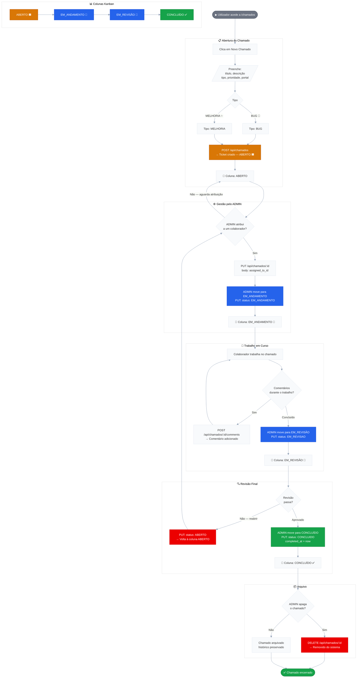
```mermaid
%%{init: {'theme': 'base', 'themeVariables': {'primaryColor': '#f8fafc', 'primaryBorderColor': '#e2e8f0', 'lineColor': '#94a3b8', 'fontSize': '13px'}}}%%
flowchart TD
    START([▶ Utilizador acede a /chamados]) --> NEW[Clica em Novo Chamado]

    subgraph ABERTURA["📋 Abertura do Chamado"]
        NEW --> FORM[/Preenche:\ntítulo, descrição\ntipo, prioridade, portal/]
        FORM --> TIPO{Tipo}
        TIPO -->|BUG 🐛| T1[Tipo: BUG]
        TIPO -->|MELHORIA ✨| T2[Tipo: MELHORIA]
        T1 & T2 --> API_CREATE[POST /api/chamados\n→ Ticket criado — ABERTO 🟧]
        API_CREATE --> COL1[📌 Coluna: ABERTO]
    end

    subgraph GESTAO["⚙️ Gestão pelo ADMIN"]
        COL1 --> ASSIGN{ADMIN atribui\na um colaborador?}
        ASSIGN -->|Sim| API_ASSIGN[PUT /api/chamados/:id\nbody: assigned_to_id]
        API_ASSIGN --> MOVE_PROG[ADMIN move para EM_ANDAMENTO\nPUT: status: EM_ANDAMENTO]
        ASSIGN -->|Não — aguarda atribuição| COL1
        MOVE_PROG --> COL2[📌 Coluna: EM_ANDAMENTO 🔵]
    end

    subgraph TRABALHO["🔨 Trabalho em Curso"]
        COL2 --> WORKING[Colaborador trabalha no chamado]
        WORKING --> COMMENTS{Comentários\ndurante o trabalho?}
        COMMENTS -->|Sim| ADD_COMMENT[POST /api/chamados/:id/comments\n→ Comentário adicionado]
        ADD_COMMENT --> WORKING
        COMMENTS -->|Concluído| MOVE_REV[ADMIN move para EM_REVISÃO\nPUT: status: EM_REVISAO]
        MOVE_REV --> COL3[📌 Coluna: EM_REVISÃO 🔵]
    end

    subgraph REVISAO["🔍 Revisão Final"]
        COL3 --> REVIEW{Revisão\npassa?}
        REVIEW -->|Não — reabrir| REOPEN[PUT: status: ABERTO\n→ Volta à coluna ABERTO]
        REOPEN --> ASSIGN
        REVIEW -->|Aprovado| MOVE_DONE[ADMIN move para CONCLUÍDO\nPUT: status: CONCLUIDO\ncompleted_at = now]
        MOVE_DONE --> COL4[📌 Coluna: CONCLUÍDO ✅]
    end

    subgraph ARQUIVO["📦 Arquivo"]
        COL4 --> DELETE{ADMIN apaga\no chamado?}
        DELETE -->|Sim| API_DEL[DELETE /api/chamados/:id\n→ Removido do sistema]
        DELETE -->|Não| ARCHIVE[Chamado arquivado\nhistórico preservado]
    end

    API_DEL & ARCHIVE --> END([✅ Chamado encerrado])

    subgraph KANBAN["📊 Colunas Kanban"]
        direction LR
        KB1[ABERTO 🟧] --> KB2[EM_ANDAMENTO 🔵] --> KB3[EM_REVISÃO 🔵] --> KB4[CONCLUÍDO ✅]
    end

    style START fill:#6b7280,color:#fff,stroke:#4b5563
    style END fill:#16a34a,color:#fff,stroke:#15803d
    style API_CREATE fill:#d97706,color:#fff,stroke:#b45309
    style MOVE_PROG fill:#2563eb,color:#fff,stroke:#1d4ed8
    style MOVE_REV fill:#2563eb,color:#fff,stroke:#1d4ed8
    style MOVE_DONE fill:#16a34a,color:#fff,stroke:#15803d
    style REOPEN fill:#EC0000,color:#fff,stroke:#CC0000
    style API_DEL fill:#EC0000,color:#fff,stroke:#CC0000
    style KB1 fill:#d97706,color:#fff,stroke:#b45309
    style KB2 fill:#2563eb,color:#fff,stroke:#1d4ed8
    style KB3 fill:#2563eb,color:#fff,stroke:#1d4ed8
    style KB4 fill:#16a34a,color:#fff,stroke:#15803d
```

---

## 5. Portal de Dados Mestres

---

### Fluxo 5.1 — Gestão de Utilizadores (ADMIN)

> **Actores:** ADMIN
> **Flags especiais:** `is_tutor`, `is_liberador`, `is_team_lead`, `is_referente`

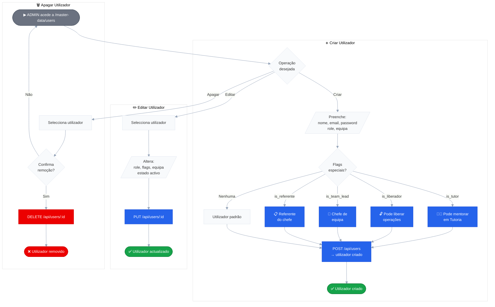
```mermaid
%%{init: {'theme': 'base', 'themeVariables': {'primaryColor': '#f8fafc', 'primaryBorderColor': '#e2e8f0', 'lineColor': '#94a3b8', 'fontSize': '13px'}}}%%
flowchart TD
    START([▶ ADMIN acede a /master-data/users]) --> OP{Operação\ndesejada}

    subgraph CRIAR["➕ Criar Utilizador"]
        OP -->|Criar| C_FORM[/Preenche:\nnome, email, password\nrole, equipa/]
        C_FORM --> C_FLAGS{Flags\nespeciais?}
        C_FLAGS -->|is_tutor| F1[👨‍🏫 Pode mentorar\nem Tutoria]
        C_FLAGS -->|is_liberador| F2[🔓 Pode liberar\noperações]
        C_FLAGS -->|is_team_lead| F3[👑 Chefe de\nequipa]
        C_FLAGS -->|is_referente| F4[📋 Referente\ndo chefe]
        C_FLAGS -->|Nenhuma| F5[Utilizador padrão]
        F1 & F2 & F3 & F4 & F5 --> C_API[POST /api/users\n→ utilizador criado]
        C_API --> C_END([✅ Utilizador criado])
    end

    subgraph EDITAR["✏️ Editar Utilizador"]
        OP -->|Editar| E_SELECT[Selecciona utilizador]
        E_SELECT --> E_FORM[/Altera:\nrole, flags, equipa\nestado activo/]
        E_FORM --> E_API[PUT /api/users/:id]
        E_API --> E_END([✅ Utilizador actualizado])
    end

    subgraph APAGAR["🗑️ Apagar Utilizador"]
        OP -->|Apagar| D_SELECT[Selecciona utilizador]
        D_SELECT --> D_CONFIRM{Confirma\nremoção?}
        D_CONFIRM -->|Não| START
        D_CONFIRM -->|Sim| D_API[DELETE /api/users/:id]
        D_API --> D_END([❌ Utilizador removido])
    end

    style START fill:#6b7280,color:#fff,stroke:#4b5563
    style C_END fill:#16a34a,color:#fff,stroke:#15803d
    style E_END fill:#16a34a,color:#fff,stroke:#15803d
    style D_END fill:#EC0000,color:#fff,stroke:#CC0000
    style C_API fill:#2563eb,color:#fff,stroke:#1d4ed8
    style E_API fill:#2563eb,color:#fff,stroke:#1d4ed8
    style D_API fill:#EC0000,color:#fff,stroke:#CC0000
    style F1 fill:#2563eb,color:#fff,stroke:#1d4ed8
    style F2 fill:#2563eb,color:#fff,stroke:#1d4ed8
    style F3 fill:#2563eb,color:#fff,stroke:#1d4ed8
    style F4 fill:#2563eb,color:#fff,stroke:#1d4ed8
```

---

### Fluxo 5.2 — Gestão de Equipas (ADMIN)

> **Actores:** ADMIN
> **Nota:** Uma equipa pode ter gestor, serviços (produtos) e membros

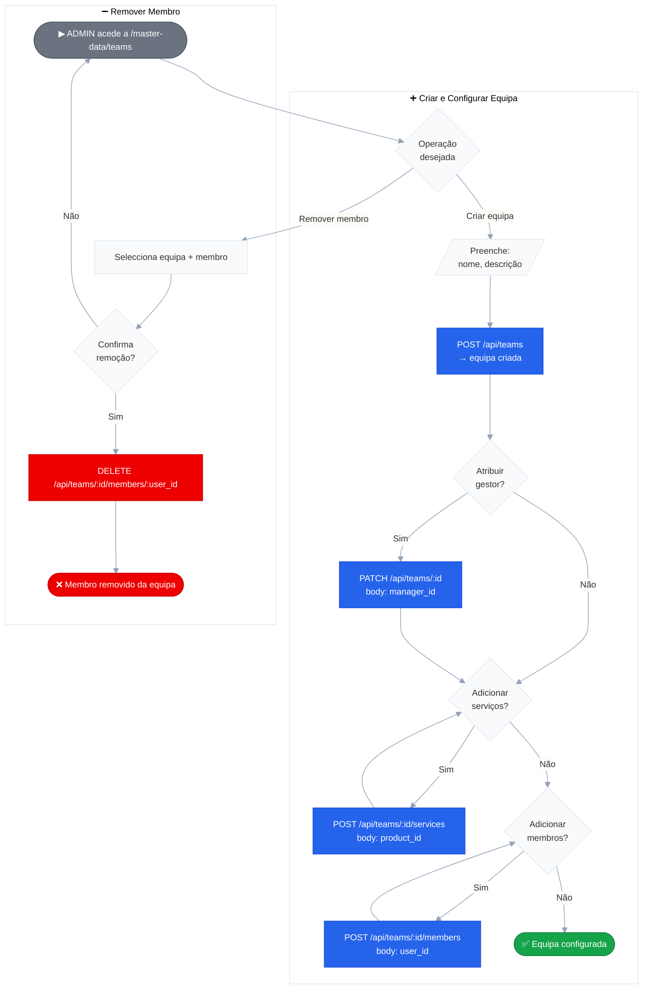
```mermaid
%%{init: {'theme': 'base', 'themeVariables': {'primaryColor': '#f8fafc', 'primaryBorderColor': '#e2e8f0', 'lineColor': '#94a3b8', 'fontSize': '13px'}}}%%
flowchart TD
    START([▶ ADMIN acede a /master-data/teams]) --> OP{Operação\ndesejada}

    subgraph CRIAR["➕ Criar e Configurar Equipa"]
        OP -->|Criar equipa| T_FORM[/Preenche:\nnome, descrição/]
        T_FORM --> T_API[POST /api/teams\n→ equipa criada]
        T_API --> T_MGR{Atribuir\ngestor?}
        T_MGR -->|Sim| T_MGR_API[PATCH /api/teams/:id\nbody: manager_id]
        T_MGR -->|Não| T_SVC
        T_MGR_API --> T_SVC

        T_SVC{Adicionar\nserviços?}
        T_SVC -->|Sim| T_SVC_API[POST /api/teams/:id/services\nbody: product_id]
        T_SVC_API --> T_SVC
        T_SVC -->|Não| T_MEM

        T_MEM{Adicionar\nmembros?}
        T_MEM -->|Sim| T_MEM_API[POST /api/teams/:id/members\nbody: user_id]
        T_MEM_API --> T_MEM
        T_MEM -->|Não| T_END([✅ Equipa configurada])
    end

    subgraph REMOVER["➖ Remover Membro"]
        OP -->|Remover membro| R_SELECT[Selecciona equipa + membro]
        R_SELECT --> R_CONFIRM{Confirma\nremoção?}
        R_CONFIRM -->|Não| START
        R_CONFIRM -->|Sim| R_API[DELETE /api/teams/:id/members/:user_id]
        R_API --> R_END([❌ Membro removido da equipa])
    end

    style START fill:#6b7280,color:#fff,stroke:#4b5563
    style T_END fill:#16a34a,color:#fff,stroke:#15803d
    style R_END fill:#EC0000,color:#fff,stroke:#CC0000
    style T_API fill:#2563eb,color:#fff,stroke:#1d4ed8
    style T_MGR_API fill:#2563eb,color:#fff,stroke:#1d4ed8
    style T_SVC_API fill:#2563eb,color:#fff,stroke:#1d4ed8
    style T_MEM_API fill:#2563eb,color:#fff,stroke:#1d4ed8
    style R_API fill:#EC0000,color:#fff,stroke:#CC0000
```

---

### Fluxo 5.3 — Gestão da Hierarquia Organizacional (ADMIN)

> **Actores:** ADMIN
> **Localização:** `/master-data/org-hierarchy`
> **Vistas disponíveis:** Árvore interactiva, Organograma visual, Log de auditoria

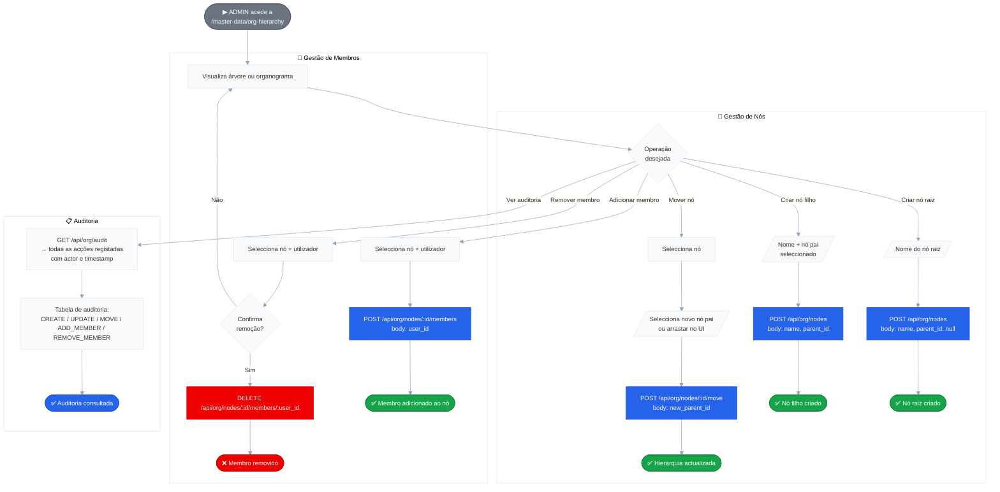
```mermaid
%%{init: {'theme': 'base', 'themeVariables': {'primaryColor': '#f8fafc', 'primaryBorderColor': '#e2e8f0', 'lineColor': '#94a3b8', 'fontSize': '13px'}}}%%
flowchart TD
    START([▶ ADMIN acede a\n/master-data/org-hierarchy]) --> VIEW[Visualiza árvore ou organograma]
    VIEW --> OP{Operação\ndesejada}

    subgraph NOS["🏢 Gestão de Nós"]
        OP -->|Criar nó raiz| N1_FORM[/Nome do nó raiz/]
        N1_FORM --> N1_API[POST /api/org/nodes\nbody: name, parent_id: null]
        N1_API --> N1_END([✅ Nó raiz criado])

        OP -->|Criar nó filho| N2_FORM[/Nome + nó pai\nseleccionado/]
        N2_FORM --> N2_API[POST /api/org/nodes\nbody: name, parent_id]
        N2_API --> N2_END([✅ Nó filho criado])

        OP -->|Mover nó| MV_SELECT[Selecciona nó]
        MV_SELECT --> MV_FORM[/Selecciona novo nó pai\nou arrastar no UI/]
        MV_FORM --> MV_API[POST /api/org/nodes/:id/move\nbody: new_parent_id]
        MV_API --> MV_END([✅ Hierarquia actualizada])
    end

    subgraph MEMBROS["👥 Gestão de Membros"]
        OP -->|Adicionar membro| AM_SELECT[Selecciona nó + utilizador]
        AM_SELECT --> AM_API[POST /api/org/nodes/:id/members\nbody: user_id]
        AM_API --> AM_END([✅ Membro adicionado ao nó])

        OP -->|Remover membro| RM_SELECT[Selecciona nó + utilizador]
        RM_SELECT --> RM_CONFIRM{Confirma\nremoção?}
        RM_CONFIRM -->|Não| VIEW
        RM_CONFIRM -->|Sim| RM_API[DELETE /api/org/nodes/:id/members/:user_id]
        RM_API --> RM_END([❌ Membro removido])
    end

    subgraph AUDITORIA["📋 Auditoria"]
        OP -->|Ver auditoria| AU_API[GET /api/org/audit\n→ todas as acções registadas\ncom actor e timestamp]
        AU_API --> AU_VIEW[Tabela de auditoria:\nCREATE / UPDATE / MOVE / ADD_MEMBER / REMOVE_MEMBER]
        AU_VIEW --> AU_END([✅ Auditoria consultada])
    end

    style START fill:#6b7280,color:#fff,stroke:#4b5563
    style N1_END fill:#16a34a,color:#fff,stroke:#15803d
    style N2_END fill:#16a34a,color:#fff,stroke:#15803d
    style MV_END fill:#16a34a,color:#fff,stroke:#15803d
    style AM_END fill:#16a34a,color:#fff,stroke:#15803d
    style RM_END fill:#EC0000,color:#fff,stroke:#CC0000
    style AU_END fill:#2563eb,color:#fff,stroke:#1d4ed8
    style N1_API fill:#2563eb,color:#fff,stroke:#1d4ed8
    style N2_API fill:#2563eb,color:#fff,stroke:#1d4ed8
    style MV_API fill:#2563eb,color:#fff,stroke:#1d4ed8
    style AM_API fill:#2563eb,color:#fff,stroke:#1d4ed8
    style RM_API fill:#EC0000,color:#fff,stroke:#CC0000
```

---

## 6. Visibilidade de Dados por Role

---

### Fluxo 6.1 — Árvore de Decisão de Scoping

> Este fluxo documenta a lógica da função `get_visible_user_ids()` no backend.
> É executada em **todos os pedidos** de dados listados, garantindo isolamento por role.

```mermaid
%%{init: {'theme': 'base', 'themeVariables': {'primaryColor': '#f8fafc', 'primaryBorderColor': '#e2e8f0', 'lineColor': '#94a3b8', 'fontSize': '13px'}}}%%
flowchart TD
    START([▶ Pedido de dados\ncom utilizador autenticado]) --> ROLE{Role do\nutilizador}

    subgraph GLOBAL["🌐 Visibilidade Global"]
        ROLE -->|ADMIN| NULL[Retorna NULL\n→ sem filtro]
        ROLE -->|GESTOR| NULL
        NULL --> ALL_DATA[✅ Vê TODOS os dados\ndo sistema]
    end

    subgraph EQUIPA["👥 Visibilidade de Equipa"]
        ROLE -->|MANAGER| TEAM_CHK{is_team_lead\n= true?}
        ROLE -->|Outro com is_team_lead| TEAM_CHK

        TEAM_CHK -->|Sim| FIND_TEAMS[Encontra equipas\nonde manager_id = user.id]
        FIND_TEAMS --> INCL_OWN[Inclui team_id\ndo próprio utilizador]
        INCL_OWN --> COLLECT_IDS[Recolhe IDs de todos\nos membros dessas equipas]
        COLLECT_IDS --> ADD_SELF[Adiciona o próprio\nuser.id à lista]
        ADD_SELF --> TEAM_DATA[🔵 Vê dados da equipa\ne subordinados]

        TEAM_CHK -->|Não| SIMPLE
    end

    subgraph PESSOAL["👤 Visibilidade Pessoal"]
        SIMPLE{Role sem\nequipa}
        SIMPLE -->|Formador\nTRAINER| SELF[Retorna [user.id]]
        SIMPLE -->|Formando\nTRAINEE / STUDENT| SELF
        SIMPLE -->|Outros roles| SELF
        SELF --> OWN_DATA[🟧 Vê apenas\nos seus próprios dados]
    end

    ALL_DATA & TEAM_DATA & OWN_DATA --> END([✅ Filtro aplicado\nDados retornados])

    subgraph RESUMO["📊 Resumo de Visibilidade"]
        direction LR
        R1[ADMIN / GESTOR\n→ Tudo 🌐]
        R2[MANAGER / Team Lead\n→ Equipa + Subordinados 👥]
        R3[Formador / Formando\n→ Apenas próprios 👤]
    end

    style START fill:#6b7280,color:#fff,stroke:#4b5563
    style END fill:#16a34a,color:#fff,stroke:#15803d
    style NULL fill:#16a34a,color:#fff,stroke:#15803d
    style ALL_DATA fill:#16a34a,color:#fff,stroke:#15803d
    style TEAM_DATA fill:#2563eb,color:#fff,stroke:#1d4ed8
    style OWN_DATA fill:#d97706,color:#fff,stroke:#b45309
    style SELF fill:#d97706,color:#fff,stroke:#b45309
    style R1 fill:#16a34a,color:#fff,stroke:#15803d
    style R2 fill:#2563eb,color:#fff,stroke:#1d4ed8
    style R3 fill:#d97706,color:#fff,stroke:#b45309
```

---

## Apêndice — Mapa de Roles e Responsabilidades

```mermaid
%%{init: {'theme': 'base', 'themeVariables': {'primaryColor': '#f8fafc', 'primaryBorderColor': '#e2e8f0', 'lineColor': '#94a3b8', 'fontSize': '13px'}}}%%
flowchart LR
    ADMIN([🔴 ADMIN]) -->|Gere tudo| TU[Utilizadores\ne Equipas]
    ADMIN -->|Valida contas| VA[Formadores\nPendentes]
    ADMIN -->|Revê| SUB[Submissões\nde Formandos]
    ADMIN -->|Move| KAN[Chamados\nKanban]

    MGR([🟣 GESTOR /\nMANAGER]) -->|Supervisiona| TEAM[Equipa\ne Dados]
    MGR -->|Visualiza| REL[Relatórios\nde equipa]

    TRN([🔵 Formador\nTRAINER]) -->|Cria| CURSOS[Cursos\ne Planos]
    TRN -->|Revê| SUBS[Submissões\nde desafios]
    TRN -->|Emite| CERT[Certificados]
    TRN -->|"Na Tutoria:\nActua como"| GRAVADOR[Gravador 🎙️\nSide-by-side\nCápsulas]

    FORMANDO([🟢 Formando\nTRAINEE]) -->|Executa| AULAS[Aulas\ne Desafios]
    FORMANDO -->|Progride| PLANOS[Planos\nde Formação]

    LIB([🟠 Liberador\nis_liberador]) -->|Regista| ERROS_INT[Erros\nInternos]
    LIB -->|Responde| SURV[Surveys\nde Feedback]

    TUTOR([🔵 Tutor\nis_tutor]) -->|Analisa| ERROS[Erros\nde Tutoria]
    TUTOR -->|Cria| PLANOS_T[Planos\nde Acção]
    TUTOR -->|Gere| SURV_T[Surveys\nSemanais]

    style ADMIN fill:#EC0000,color:#fff,stroke:#CC0000
    style MGR fill:#7c3aed,color:#fff,stroke:#6d28d9
    style TRN fill:#2563eb,color:#fff,stroke:#1d4ed8
    style FORMANDO fill:#16a34a,color:#fff,stroke:#15803d
    style LIB fill:#d97706,color:#fff,stroke:#b45309
    style TUTOR fill:#0891b2,color:#fff,stroke:#0e7490
    style GRAVADOR fill:#2563eb,color:#fff,stroke:#1d4ed8
```

---

*Documento gerado em 2026-03-21 — PortalTradeHub v2.0*
